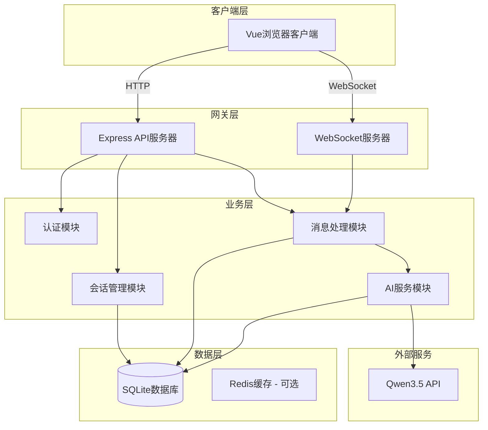
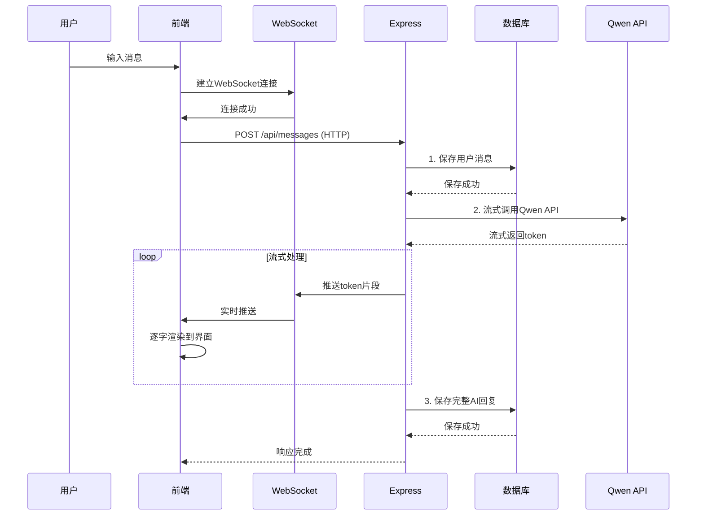
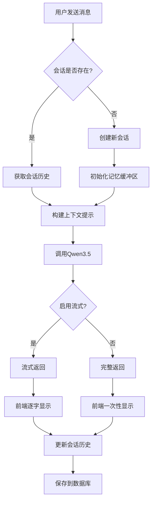
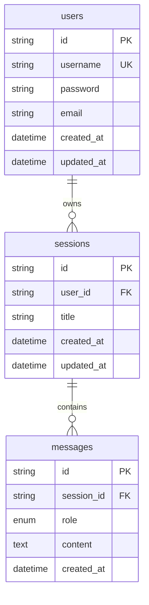
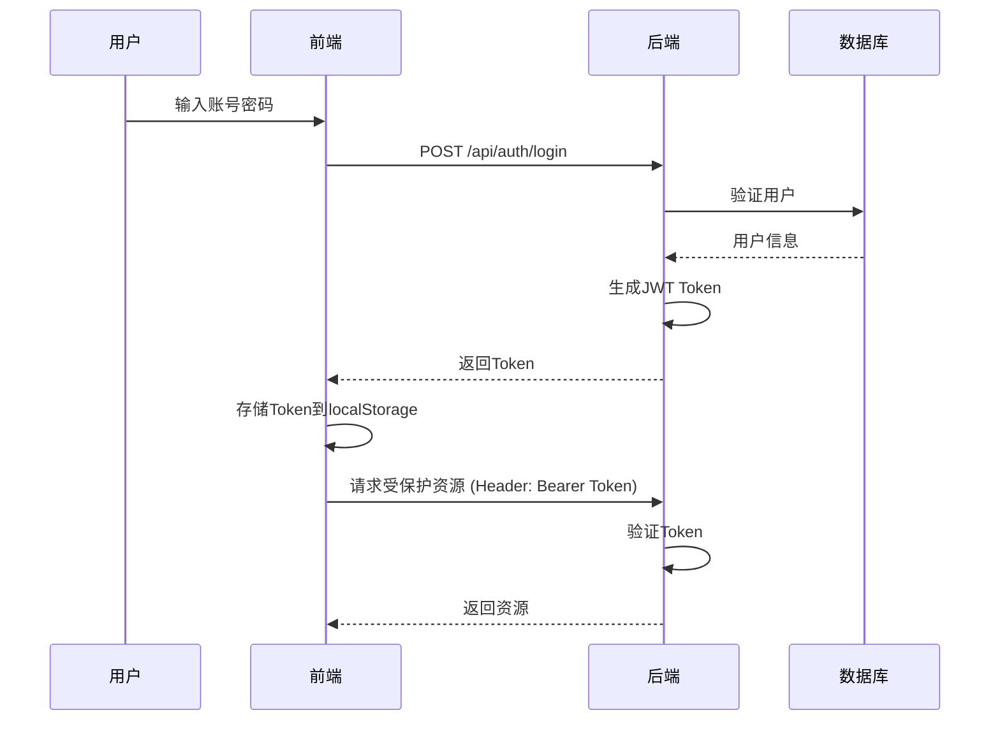

# AI客服系统设计文档

**文档版本**: v2.0  
**创建日期**: 2026-05-06  
**适用项目**: AI客服系统

---

## 目录

1. [需求分析](#1-需求分析)
2. [技术选型](#2-技术选型)
3. [架构设计](#3-架构设计)
4. [目录结构](#4-目录结构)
5. [数据库设计](#5-数据库设计)
6. [API设计](#6-api设计)
7. [核心功能实现](#7-核心功能实现)
8. [流式输出实现](#8-流式输出实现)
9. [前端设计](#9-前端设计)
10. [安全方案](#10-安全方案)
11. [性能优化](#11-性能优化)
12. [监控与日志](#12-监控与日志)
13. [测试方案](#13-测试方案)
14. [部署方案](#14-部署方案)
15. [数据备份与恢复](#15-数据备份与恢复)
16. [项目规划](#16-项目规划)
17. [附录](#17-附录)

---

## 1. 需求分析

### 1.1 业务背景

基于用户需求，设计一个具有聊天记忆功能的AI客服系统，支持多轮对话，能够记住用户上下文并提供个性化服务。系统采用前后端分离架构，前端提供流畅的交互体验，后端提供稳定的AI服务。

### 1.2 核心需求

| 需求编号 | 需求描述                      | 来源                     | 优先级 |
| :------- | :---------------------------- | :----------------------- | :----- |
| REQ-001  | 前后端分离架构                | "要求前后端分离"         | P0     |
| REQ-002  | 前端技术栈：Vite + Vue        | "前端使用vite+vue"       | P0     |
| REQ-003  | 后端技术栈：Node.js + Express | "后端使用nodejs+express" | P0     |
| REQ-004  | AI模型：Qwen3.5               | "Qwen3.5"                | P0     |
| REQ-005  | AI框架：LangChain             | "langchain"              | P0     |
| REQ-006  | 聊天记忆功能                  | "用户需要有聊天记忆功能" | P0     |
| REQ-007  | 流式输出（打字机效果）        | 新增需求                 | P0     |
| REQ-008  | 多轮对话支持                  | 聊天记忆功能衍生需求     | P1     |
| REQ-009  | 会话管理                      | 多用户并发支持           | P1     |
| REQ-010  | 用户认证                      | 安全性要求               | P1     |

### 1.3 功能需求

#### 1.3.1 核心功能

| 功能         | 描述                         | 验收标准             |
| :----------- | :--------------------------- | :------------------- |
| **对话交互** | 用户与AI客服的实时消息交互   | 消息发送<100ms响应   |
| **聊天记忆** | 保留对话历史，支持上下文理解 | 支持至少20轮对话记忆 |
| **流式输出** | AI回复像打印机一样逐字输出   | 实时显示AI生成内容   |
| **会话管理** | 支持多会话创建、查询、删除   | 支持100+并发会话     |

#### 1.3.2 辅助功能

| 功能        | 描述                 |
| :---------- | :------------------- |
| 消息持久化  | 对话记录存储到数据库 |
| RESTful API | 提供标准化API接口    |
| 错误处理    | 统一的错误响应机制   |
| 用户认证    | JWT Token身份验证    |

---

## 2. 技术选型

### 2.1 技术栈概览

| 分类       | 技术       | 版本   | 选型理由                      |
| :--------- | :--------- | :----- | :---------------------------- |
| 前端框架   | Vue        | 3.5.x  | 轻量、响应式、Composition API |
| 构建工具   | Vite       | 5.4.x  | 快速构建、HMR热更新           |
| 后端框架   | Express    | 4.21.x | 轻量、灵活、社区成熟          |
| 语言       | TypeScript | 5.6.x  | 类型安全、IDE友好             |
| AI模型     | Qwen3.5    | latest | 阿里云开源大模型，性能优秀    |
| AI框架     | LangChain  | 1.4.x  | 提供对话链和记忆管理能力      |
| 数据库     | SQLite     | 3.x    | 轻量嵌入式数据库              |
| ORM        | Prisma     | 6.x    | TypeScript友好、类型安全      |
| HTTP客户端 | Axios      | 1.7.x  | 成熟稳定的HTTP库              |
| 状态管理   | Pinia      | 2.x    | Vue官方推荐的状态管理库       |
| WebSocket  | ws         | 8.x    | Node.js原生WebSocket库        |

### 2.2 关键依赖说明

#### 2.2.1 前端依赖

```json
{
  "dependencies": {
    "vue": "^3.5.0",
    "vue-router": "^4.4.0",
    "pinia": "^2.2.0",
    "axios": "^1.7.0",
    "marked": "^15.0.0"
  },
  "devDependencies": {
    "vite": "^5.4.0",
    "@vitejs/plugin-vue": "^5.1.0",
    "typescript": "^5.6.0"
  }
}
```

#### 2.2.2 后端依赖

```json
{
  "dependencies": {
    "express": "^4.21.0",
    "@prisma/client": "^6.0.0",
    "langchain": "^1.4.0",
    "@langchain/core": "^0.3.0",
    "@langchain/openai": "^0.4.0",
    "jsonwebtoken": "^9.0.0",
    "bcryptjs": "^2.4.3",
    "cors": "^2.8.5",
    "dotenv": "^16.4.0",
    "ws": "^8.18.0"
  },
  "devDependencies": {
    "prisma": "^6.0.0",
    "typescript": "^5.6.0",
    "@types/node": "^22.0.0"
  }
}
```

### 2.3 Qwen3.5集成说明

使用阿里云DashScope服务调用Qwen3.5模型，需配置以下环境变量：

```bash
# .env
QWEN_API_KEY=sk-xxxxxxxxxxxxxxxx
QWEN_BASE_URL=https://dashscope.aliyuncs.com/compatible-mode/v1
QWEN_MODEL_NAME=qwen-turbo  # 或 qwen-plus、qwen-max
```

---

## 3. 架构设计

### 3.1 整体架构



### 3.2 模块职责

| 模块      | 职责                     | 技术实现                |
| :-------- | :----------------------- | :---------------------- |
| 认证模块  | 用户注册、登录、JWT签发  | jsonwebtoken + bcryptjs |
| 会话管理  | 会话CRUD、用户会话列表   | Prisma ORM              |
| 消息处理  | 消息收发、存储、历史查询 | Prisma ORM              |
| AI服务    | 流式回复生成、上下文管理 | LangChain + Qwen API    |
| WebSocket | 实时消息推送             | ws 库                   |

### 3.3 核心流程图

#### 3.3.1 消息发送流程（流式输出）



#### 3.3.2 聊天记忆机制



---

## 4. 目录结构

### 4.1 项目根目录

```
ai-customer-service/
├── backend/                  # 后端项目
├── frontend/                 # 前端项目
├── docs/                     # 文档
└── README.md
```

### 4.2 后端目录结构

```
backend/
├── src/
│   ├── config/
│   │   ├── database.ts       # Prisma数据库配置
│   │   └── env.ts            # 环境变量配置
│   ├── controllers/          # 控制器层
│   │   ├── auth.controller.ts
│   │   ├── session.controller.ts
│   │   └── message.controller.ts
│   ├── services/             # 服务层
│   │   ├── auth.service.ts
│   │   ├── ai.service.ts
│   │   ├── session.service.ts
│   │   └── message.service.ts
│   ├── routes/               # 路由定义
│   │   ├── auth.routes.ts
│   │   ├── session.routes.ts
│   │   └── message.routes.ts
│   ├── middleware/           # 中间件
│   │   ├── auth.middleware.ts
│   │   ├── error.middleware.ts
│   │   └── rateLimit.middleware.ts
│   ├── types/                # 类型定义
│   │   └── index.ts
│   ├── utils/                # 工具函数
│   │   ├── langchain.ts
│   │   └── jwt.ts
│   ├── app.ts               # Express应用
│   └── server.ts             # 服务器入口
├── prisma/
│   └── schema.prisma         # 数据库Schema
├── .env                      # 环境变量
├── .env.example              # 环境变量示例
├── package.json
├── tsconfig.json
└── .gitignore
```

### 4.3 前端目录结构

```
frontend/
├── src/
│   ├── api/                  # API请求
│   │   ├── index.ts
│   │   ├── auth.ts
│   │   ├── session.ts
│   │   └── message.ts
│   ├── assets/               # 静态资源
│   │   └── styles/
│   │       └── main.css
│   ├── components/           # 公共组件
│   │   ├── ChatInput.vue
│   │   ├── MessageBubble.vue
│   │   ├── SessionItem.vue
│   │   └── LoadingDots.vue
│   ├── composables/          # 组合式函数
│   │   ├── useWebSocket.ts
│   │   └── useStream.ts
│   ├── router/               # 路由配置
│   │   └── index.ts
│   ├── stores/               # Pinia状态管理
│   │   ├── auth.ts
│   │   └── chat.ts
│   ├── types/                 # 类型定义
│   │   └── index.ts
│   ├── views/
│   │   ├── LoginView.vue
│   │   └── ChatView.vue
│   ├── App.vue
│   └── main.ts
├── index.html
├── package.json
├── vite.config.ts
├── tsconfig.json
└── .env
```

---

## 5. 数据库设计

### 5.1 数据库表结构

#### 5.1.1 users 表（用户表）

| 字段名    | 类型         | 约束             | 说明         |
| :-------- | :----------- | :--------------- | :----------- |
| id        | VARCHAR(36)  | PRIMARY KEY      | 用户UUID     |
| username  | VARCHAR(50)  | UNIQUE, NOT NULL | 用户名       |
| password  | VARCHAR(255) | NOT NULL         | 加密后的密码 |
| email     | VARCHAR(100) | UNIQUE           | 邮箱（可选） |
| createdAt | DATETIME     | NOT NULL         | 创建时间     |
| updatedAt | DATETIME     | NOT NULL         | 更新时间     |

#### 5.1.2 sessions 表（会话表）

| 字段名    | 类型         | 约束             | 说明     |
| :-------- | :----------- | :--------------- | :------- |
| id        | VARCHAR(36)  | PRIMARY KEY      | 会话UUID |
| userId    | VARCHAR(36)  | FOREIGN KEY      | 用户ID   |
| title     | VARCHAR(255) | DEFAULT '新会话' | 会话标题 |
| createdAt | DATETIME     | NOT NULL         | 创建时间 |
| updatedAt | DATETIME     | NOT NULL         | 更新时间 |

索引：

- `idx_sessions_userId` ON sessions(userId)
- `idx_sessions_updatedAt` ON sessions(updatedAt)

#### 5.1.3 messages 表（消息表）

| 字段名    | 类型        | 约束        | 说明                        |
| :-------- | :---------- | :---------- | :-------------------------- |
| id        | VARCHAR(36) | PRIMARY KEY | 消息UUID                    |
| sessionId | VARCHAR(36) | FOREIGN KEY | 会话ID                      |
| role      | ENUM        | NOT NULL    | 角色(user/assistant/system) |
| content   | TEXT        | NOT NULL    | 消息内容                    |
| createdAt | DATETIME    | NOT NULL    | 创建时间                    |

索引：

- `idx_messages_sessionId` ON messages(sessionId)
- `idx_messages_createdAt` ON messages(createdAt)

### 5.2 ER图



### 5.3 Prisma Schema

```prisma
// backend/prisma/schema.prisma

generator client {
  provider = "prisma-client-js"
}

datasource db {
  provider = "sqlite"
  url      = env("DATABASE_URL")
}

model User {
  id        String    @id @default(uuid())
  username  String    @unique
  password  String
  email     String?   @unique
  createdAt DateTime  @default(now()) @map("created_at")
  updatedAt DateTime  @updatedAt @map("updated_at")
  sessions  Session[]

  @@map("users")
}

model Session {
  id        String    @id @default(uuid())
  userId    String    @map("user_id")
  title     String    @default("新会话")
  createdAt DateTime  @default(now()) @map("created_at")
  updatedAt DateTime  @updatedAt @map("updated_at")
  user      User      @relation(fields: [userId], references: [id], onDelete: Cascade)
  messages  Message[]

  @@index([userId])
  @@index([updatedAt])
  @@map("sessions")
}

model Message {
  id         String    @id @default(uuid())
  sessionId  String    @map("session_id")
  role       Role      @default(USER)
  content    String
  createdAt  DateTime  @default(now()) @map("created_at")

  session    Session   @relation(fields: [sessionId], references: [id], onDelete: Cascade)

  @@index([sessionId])
  @@index([createdAt])
  @@map("messages")
}

enum Role {
  USER      @map("user")
  ASSISTANT @map("assistant")
  SYSTEM    @map("system")
}
```

---

## 6. API设计

### 6.1 基础信息

| 项目     | 说明                      |
| :------- | :------------------------ |
| 基础URL  | http://localhost:3000/api |
| 认证方式 | Bearer Token (JWT)        |
| 响应格式 | JSON                      |
| 字符编码 | UTF-8                     |

### 6.2 认证接口

#### 6.2.1 用户注册

| 属性       | 值                   |
| :--------- | :------------------- |
| **URL**    | `/api/auth/register` |
| **Method** | POST                 |

**请求体：**

```json
{
  "username": "string (必填, 3-20字符)",
  "password": "string (必填, 6-20字符)",
  "email": "string (可选)"
}
```

**成功响应 (201)：**

```json
{
  "id": "uuid",
  "username": "string",
  "email": "string",
  "createdAt": "datetime"
}
```

#### 6.2.2 用户登录

| 属性       | 值                |
| :--------- | :---------------- |
| **URL**    | `/api/auth/login` |
| **Method** | POST              |

**请求体：**

```json
{
  "username": "string",
  "password": "string"
}
```

**成功响应 (200)：**

```json
{
  "token": "jwt_token_string",
  "user": {
    "id": "uuid",
    "username": "string",
    "email": "string"
  }
}
```

### 6.3 会话管理接口

#### 6.3.1 创建会话

| 属性       | 值              |
| :--------- | :-------------- |
| **URL**    | `/api/sessions` |
| **Method** | POST            |
| **认证**   | 需要            |

**请求体：**

```json
{
  "title": "string (可选, 默认'新会话')"
}
```

**成功响应 (201)：**

```json
{
  "id": "uuid",
  "userId": "uuid",
  "title": "string",
  "createdAt": "datetime",
  "updatedAt": "datetime"
}
```

#### 6.3.2 获取会话列表

| 属性       | 值              |
| :--------- | :-------------- |
| **URL**    | `/api/sessions` |
| **Method** | GET             |
| **认证**   | 需要            |

**查询参数：**
| 参数 | 类型 | 说明 |
| :--- | :--- | :--- |
| page | number | 页码，默认1 |
| limit | number | 每页数量，默认20 |

**成功响应 (200)：**

```json
{
  "data": [
    {
      "id": "uuid",
      "title": "string",
      "createdAt": "datetime",
      "updatedAt": "datetime",
      "messages": []
    }
  ],
  "pagination": {
    "page": 1,
    "limit": 20,
    "total": 10
  }
}
```

#### 6.3.3 获取单个会话

| 属性       | 值                  |
| :--------- | :------------------ |
| **URL**    | `/api/sessions/:id` |
| **Method** | GET                 |
| **认证**   | 需要                |

**成功响应 (200)：**

```json
{
  "id": "uuid",
  "userId": "uuid",
  "title": "string",
  "createdAt": "datetime",
  "updatedAt": "datetime",
  "messages": [
    {
      "id": "uuid",
      "role": "user",
      "content": "string",
      "createdAt": "datetime"
    }
  ]
}
```

#### 6.3.4 删除会话

| 属性       | 值                  |
| :--------- | :------------------ |
| **URL**    | `/api/sessions/:id` |
| **Method** | DELETE              |
| **认证**   | 需要                |

**成功响应 (204)：** 无内容

### 6.4 消息接口

#### 6.4.1 发送消息（流式输出核心接口）

| 属性         | 值                       |
| :----------- | :----------------------- |
| **URL**      | `/api/messages/stream`   |
| **Method**   | POST                     |
| **认证**     | 需要                     |
| **返回方式** | Server-Sent Events (SSE) |

**请求头：**

```http
Content-Type: application/json
Authorization: Bearer <token>
```

**请求体：**

```json
{
  "sessionId": "uuid (可选，不传则创建新会话)",
  "content": "string (用户消息内容)"
}
```

**响应格式 (SSE)：**

```http
HTTP/1.1 200 OK
Content-Type: text/event-stream
Cache-Control: no-cache
Connection: keep-alive

data: {"type": "token", "content": "你"}

data: {"type": "token", "content": "好"}

data: {"type": "token", "content": "！"}

data: {"type": "done", "messageId": "uuid"}
```

**事件类型：**
| 类型 | 说明 |
| :--- | :--- |
| token | 单个token片段 |
| done | 完成标志 |
| error | 错误信息 |

#### 6.4.2 发送消息（非流式）

| 属性       | 值              |
| :--------- | :-------------- |
| **URL**    | `/api/messages` |
| **Method** | POST            |
| **认证**   | 需要            |

**成功响应 (200)：**

```json
{
  "id": "uuid",
  "sessionId": "uuid",
  "role": "assistant",
  "content": "string (完整回复)",
  "createdAt": "datetime"
}
```

#### 6.4.3 获取会话消息列表

| 属性       | 值                            |
| :--------- | :---------------------------- |
| **URL**    | `/api/messages?sessionId=:id` |
| **Method** | GET                           |
| **认证**   | 需要                          |

**查询参数：**
| 参数 | 类型 | 说明 |
| :--- | :--- | :--- |
| sessionId | string | 必填 |
| page | number | 页码 |
| limit | number | 每页数量 |

### 6.5 错误响应格式

```json
{
  "error": {
    "code": "ERROR_CODE",
    "message": "错误描述",
    "details": "详细信息 (可选)"
  }
}
```

**常见错误码：**
| 错误码 | HTTP状态码 | 说明 |
| :--- | :--- | :--- |
| UNAUTHORIZED | 401 | 未授权 |
| FORBIDDEN | 403 | 禁止访问 |
| NOT_FOUND | 404 | 资源不存在 |
| VALIDATION_ERROR | 400 | 参数验证失败 |
| RATE_LIMIT | 429 | 请求频率超限 |
| INTERNAL_ERROR | 500 | 服务器内部错误 |
| AI_SERVICE_ERROR | 502 | AI服务调用失败 |

---

## 7. 核心功能实现

### 7.1 用户认证模块

#### 7.1.1 JWT工具函数

```typescript
// backend/src/utils/jwt.ts
import jwt from "jsonwebtoken";

const JWT_SECRET = process.env.JWT_SECRET || "your-secret-key";
const JWT_EXPIRES_IN = "7d";

export interface TokenPayload {
  userId: string;
  username: string;
}

export function generateToken(payload: TokenPayload): string {
  return jwt.sign(payload, JWT_SECRET, { expiresIn: JWT_EXPIRES_IN });
}

export function verifyToken(token: string): TokenPayload {
  return jwt.verify(token, JWT_SECRET) as TokenPayload;
}
```

#### 7.1.2 认证中间件

```typescript
// backend/src/middleware/auth.middleware.ts
import { Request, Response, NextFunction } from "express";
import { verifyToken } from "../utils/jwt";

export interface AuthRequest extends Request {
  userId?: string;
  username?: string;
}

export const authMiddleware = (
  req: AuthRequest,
  res: Response,
  next: NextFunction,
) => {
  const authHeader = req.headers.authorization;

  if (!authHeader || !authHeader.startsWith("Bearer ")) {
    return res.status(401).json({
      error: { code: "UNAUTHORIZED", message: "缺少认证令牌" },
    });
  }

  const token = authHeader.split(" ")[1];

  try {
    const payload = verifyToken(token);
    req.userId = payload.userId;
    req.username = payload.username;
    next();
  } catch (error) {
    return res.status(401).json({
      error: { code: "UNAUTHORIZED", message: "令牌无效或已过期" },
    });
  }
};
```

### 7.2 AI服务模块

#### 7.2.1 LangChain配置

```typescript
// backend/src/utils/langchain.ts
import { ChatOpenAI } from "@langchain/openai";
import { HumanMessage, AIMessage } from "@langchain/core/messages";

export interface Message {
  id: string;
  role: "user" | "assistant" | "system";
  content: string;
}

export function createQwenLLM() {
  return new ChatOpenAI({
    openAIApiKey: process.env.QWEN_API_KEY!,
    baseURL:
      process.env.QWEN_BASE_URL ||
      "https://dashscope.aliyuncs.com/compatible-mode/v1",
    modelName: process.env.QWEN_MODEL_NAME || "qwen-turbo",
    temperature: 0.7,
    streaming: true,
  });
}

export function messagesToLangChain(msgs: Message[]) {
  return msgs.map((msg) =>
    msg.role === "user"
      ? new HumanMessage(msg.content)
      : new AIMessage(msg.content),
  );
}
```

#### 7.2.2 AI流式回复服务

```typescript
// backend/src/services/ai.service.ts
import {
  createQwenLLM,
  messagesToLangChain,
  Message,
} from "../utils/langchain";
import { ConversationChain } from "@langchain/classic/chains";
import { BufferMemory } from "@langchain/classic/memory";
import {
  ChatPromptTemplate,
  MessagesPlaceholder,
} from "@langchain/core/prompts";

export class AIService {
  async *generateStreamResponse(
    sessionId: string,
    messages: Message[],
  ): AsyncGenerator<string> {
    const llm = createQwenLLM();

    const memory = new BufferMemory({
      returnMessages: true,
      memoryKey: "history",
    });

    // 加载历史消息到记忆
    const lcMessages = messagesToLangChain(messages);
    for (const msg of lcMessages) {
      await memory.chatHistory.addMessage(msg);
    }

    const prompt = ChatPromptTemplate.fromMessages([
      ["system", this.getSystemPrompt()],
      new MessagesPlaceholder("history"),
      ["human", "{input}"],
    ]);

    const chain = new ConversationChain({
      llm,
      prompt,
      memory,
    });

    // 流式调用
    const stream = await chain.stream({
      input: messages[messages.length - 1].content,
    });

    for await (const chunk of stream) {
      yield chunk.response;
    }
  }

  async generateResponse(
    sessionId: string,
    messages: Message[],
  ): Promise<string> {
    const llm = createQwenLLM();

    const memory = new BufferMemory({
      returnMessages: true,
      memoryKey: "history",
    });

    const lcMessages = messagesToLangChain(messages);
    for (const msg of lcMessages) {
      await memory.chatHistory.addMessage(msg);
    }

    const prompt = ChatPromptTemplate.fromMessages([
      ["system", this.getSystemPrompt()],
      new MessagesPlaceholder("history"),
      ["human", "{input}"],
    ]);

    const chain = new ConversationChain({
      llm,
      prompt,
      memory,
    });

    const result = await chain.invoke({
      input: messages[messages.length - 1].content,
    });

    return result.response as string;
  }

  private getSystemPrompt(): string {
    return `你是一位专业、友好的客服代表。请遵循以下规则：
1. 根据用户提供的问题给出准确、清晰的回答
2. 保持友好、耐心的服务态度
3. 回答要简洁明了，避免冗长
4. 如果遇到无法回答的问题，请礼貌地引导用户联系人工客服
5. 记住对话上下文，提供连贯的服务`;
  }
}
```

### 7.3 消息服务

```typescript
// backend/src/services/message.service.ts
import { PrismaClient } from "@prisma/client";
import { AIService } from "./ai.service";

const prisma = new PrismaClient();
const aiService = new AIService();

export class MessageService {
  async createMessageStream(
    sessionId: string | null,
    userId: string,
    content: string,
  ): Promise<{ sessionId: string; messageId: string }> {
    // 获取或创建会话
    let session;
    if (sessionId) {
      session = await prisma.session.findUnique({ where: { id: sessionId } });
    }

    if (!session) {
      session = await prisma.session.create({
        data: { userId, title: "新会话" },
      });
    }

    // 保存用户消息
    const userMessage = await prisma.message.create({
      data: {
        sessionId: session.id,
        role: "USER",
        content,
      },
    });

    // 获取历史消息
    const history = await prisma.message.findMany({
      where: { sessionId: session.id },
      orderBy: { createdAt: "asc" },
    });

    return {
      sessionId: session.id,
      messageId: userMessage.id,
    };
  }

  async saveAssistantMessage(sessionId: string, content: string): Promise<any> {
    return await prisma.message.create({
      data: {
        sessionId,
        role: "ASSISTANT",
        content,
      },
    });
  }
}
```

---

## 8. 流式输出实现

### 8.1 后端SSE接口

```typescript
// backend/src/controllers/message.controller.ts
import { Request, Response } from "express";
import { AuthRequest } from "../middleware/auth.middleware";
import { MessageService } from "../services/message.service";
import { AIService } from "../services/ai.service";
import { PrismaClient } from "@prisma/client";

const prisma = new PrismaClient();
const messageService = new MessageService();
const aiService = new AIService();

export const streamMessage = async (req: AuthRequest, res: Response) => {
  const { sessionId, content } = req.body;
  const userId = req.userId!;

  // 设置SSE响应头
  res.setHeader("Content-Type", "text/event-stream");
  res.setHeader("Cache-Control", "no-cache");
  res.setHeader("Connection", "keep-alive");
  res.setHeader("X-Accel-Buffering", "no");

  try {
    // 1. 创建消息记录
    const { sessionId: actualSessionId, messageId } =
      await messageService.createMessageStream(sessionId, userId, content);

    // 2. 获取历史消息
    const history = await prisma.message.findMany({
      where: { sessionId: actualSessionId },
      orderBy: { createdAt: "asc" },
    });

    // 3. 流式生成回复
    let fullContent = "";

    for await (const token of aiService.generateStreamResponse(
      actualSessionId,
      history,
    )) {
      res.write(
        `data: ${JSON.stringify({ type: "token", content: token })}\n\n`,
      );
      fullContent += token;
    }

    // 4. 保存完整回复到数据库
    await messageService.saveAssistantMessage(actualSessionId, fullContent);

    // 5. 发送完成信号
    res.write(`data: ${JSON.stringify({ type: "done", messageId })}\n\n`);
    res.end();
  } catch (error: any) {
    console.error("流式响应错误:", error);
    res.write(
      `data: ${JSON.stringify({ type: "error", message: error.message })}\n\n`,
    );
    res.end();
  }
};
```

### 8.2 路由配置

```typescript
// backend/src/routes/message.routes.ts
import { Router } from "express";
import { streamMessage } from "../controllers/message.controller";
import { authMiddleware } from "../middleware/auth.middleware";

const router = Router();

router.post("/stream", authMiddleware, streamMessage);

export default router;
```

### 8.3 前端流式接收

```typescript
// frontend/src/composables/useStream.ts
import { ref, onUnmounted } from "vue";

interface StreamOptions {
  onToken: (token: string) => void;
  onDone: () => void;
  onError: (error: string) => void;
}

export function useStream() {
  const abortController = ref<AbortController | null>(null);

  async function sendMessage(
    token: string,
    data: { sessionId?: string; content: string },
    options: StreamOptions,
  ) {
    abortController.value = new AbortController();

    try {
      const response = await fetch("/api/messages/stream", {
        method: "POST",
        headers: {
          "Content-Type": "application/json",
          Authorization: `Bearer ${token}`,
        },
        body: JSON.stringify(data),
        signal: abortController.value.signal,
      });

      if (!response.ok) {
        const error = await response.json();
        throw new Error(error.error?.message || "请求失败");
      }

      const reader = response.body?.getReader();
      const decoder = new TextDecoder();

      if (!reader) {
        throw new Error("无法读取响应");
      }

      while (true) {
        const { done, value } = await reader.read();

        if (done) break;

        const text = decoder.decode(value);
        const lines = text.split("\n");

        for (const line of lines) {
          if (line.startsWith("data: ")) {
            try {
              const data = JSON.parse(line.slice(6));

              if (data.type === "token") {
                options.onToken(data.content);
              } else if (data.type === "done") {
                options.onDone();
              } else if (data.type === "error") {
                options.onError(data.message);
              }
            } catch (e) {
              // 忽略解析错误
            }
          }
        }
      }
    } catch (error: any) {
      if (error.name !== "AbortError") {
        options.onError(error.message);
      }
    }
  }

  function cancel() {
    abortController.value?.abort();
  }

  onUnmounted(() => {
    cancel();
  });

  return { sendMessage, cancel };
}
```

### 8.4 前端聊天组件实现

```vue
<!-- frontend/src/views/ChatView.vue -->
<template>
  <div class="chat-view">
    <div class="chat-messages" ref="messagesRef">
      <MessageBubble v-for="msg in messages" :key="msg.id" :message="msg" />

      <!-- AI正在输入时显示 -->
      <div v-if="isStreaming" class="streaming-indicator">
        <LoadingDots />
        <span class="streaming-text">AI正在回复...</span>
      </div>
    </div>

    <div class="chat-input">
      <ChatInput
        v-model="inputMessage"
        :disabled="isStreaming"
        @submit="handleSend"
      />
    </div>
  </div>
</template>

<script setup lang="ts">
import { ref, nextTick } from "vue";
import { useChatStore } from "@/stores/chat";
import { useStream } from "@/composables/useStream";
import MessageBubble from "@/components/MessageBubble.vue";
import ChatInput from "@/components/ChatInput.vue";
import LoadingDots from "@/components/LoadingDots.vue";

const chatStore = useChatStore();
const { sendMessage } = useStream();

const inputMessage = ref("");
const isStreaming = ref(false);
const currentStreamContent = ref("");
const messagesRef = ref<HTMLElement | null>(null);

async function handleSend() {
  if (!inputMessage.value.trim() || isStreaming.value) return;

  const userMessage = inputMessage.value.trim();
  inputMessage.value = "";

  // 添加用户消息
  chatStore.addMessage({
    id: Date.now().toString(),
    role: "user",
    content: userMessage,
    createdAt: new Date().toISOString(),
  });

  isStreaming.value = true;
  currentStreamContent.value = "";

  // 滚动到底部
  await nextTick();
  scrollToBottom();

  // 发送消息并接收流式响应
  sendMessage(
    chatStore.token,
    {
      sessionId: chatStore.activeSessionId || undefined,
      content: userMessage,
    },
    {
      onToken: (token) => {
        currentStreamContent.value += token;

        // 更新最后一条AI消息或创建新消息
        const lastMsg = chatStore.messages[chatStore.messages.length - 1];
        if (lastMsg?.role === "assistant") {
          lastMsg.content = currentStreamContent.value;
        } else {
          chatStore.addMessage({
            id: `temp-${Date.now()}`,
            role: "assistant",
            content: currentStreamContent.value,
            createdAt: new Date().toISOString(),
          });
        }

        nextTick(() => scrollToBottom());
      },
      onDone: () => {
        isStreaming.value = false;
        chatStore.setActiveSessionId(
          chatStore.activeSessionId || chatStore.sessions[0]?.id,
        );
      },
      onError: (error) => {
        isStreaming.value = false;
        console.error("Error:", error);
      },
    },
  );
}

function scrollToBottom() {
  if (messagesRef.value) {
    messagesRef.value.scrollTop = messagesRef.value.scrollHeight;
  }
}
</script>

<style scoped>
.chat-view {
  display: flex;
  flex-direction: column;
  height: 100vh;
}

.chat-messages {
  flex: 1;
  overflow-y: auto;
  padding: 20px;
}

.chat-input {
  padding: 20px;
  border-top: 1px solid #eee;
}

.streaming-indicator {
  display: flex;
  align-items: center;
  gap: 10px;
  padding: 10px;
  color: #666;
}

.streaming-text {
  font-size: 12px;
}
</style>
```

### 8.5 打字机效果组件

```vue
<!-- frontend/src/components/LoadingDots.vue -->
<template>
  <span class="loading-dots">
    <span class="dot"></span>
    <span class="dot"></span>
    <span class="dot"></span>
  </span>
</template>

<style scoped>
.loading-dots {
  display: inline-flex;
  gap: 4px;
}

.dot {
  width: 8px;
  height: 8px;
  background-color: #999;
  border-radius: 50%;
  animation: bounce 1.4s infinite ease-in-out both;
}

.dot:nth-child(1) {
  animation-delay: -0.32s;
}

.dot:nth-child(2) {
  animation-delay: -0.16s;
}

@keyframes bounce {
  0%,
  80%,
  100% {
    transform: scale(0);
  }
  40% {
    transform: scale(1);
  }
}
</style>
```

---

## 9. 前端设计

### 9.1 组件设计

#### 9.1.1 ChatWindow 组件

| 属性      | 类型   | 说明       |
| :-------- | :----- | :--------- |
| sessionId | string | 当前会话ID |

| 事件 | 参数            | 说明     |
| :--- | :-------------- | :------- |
| send | content: string | 发送消息 |

#### 9.1.2 MessageBubble 组件

| 属性      | 类型    | 说明             |
| :-------- | :------ | :--------------- |
| message   | Message | 消息对象         |
| streaming | boolean | 是否正在流式输出 |

| 样式变体                             |
| :----------------------------------- |
| user - 用户消息，右对齐，深色背景    |
| assistant - AI消息，左对齐，浅色背景 |

#### 9.1.3 ChatInput 组件

| 属性        | 类型    | 说明     |
| :---------- | :------ | :------- |
| modelValue  | string  | 输入内容 |
| disabled    | boolean | 是否禁用 |
| placeholder | string  | 占位符   |

| 事件              | 参数            | 说明     |
| :---------------- | :-------------- | :------- |
| update:modelValue | value: string   | 输入变化 |
| submit            | content: string | 提交消息 |

#### 9.1.4 SessionList 组件

| 属性     | 类型      | 说明           |
| :------- | :-------- | :------------- |
| sessions | Session[] | 会话列表       |
| activeId | string    | 当前选中会话ID |

| 事件   | 参数              | 说明       |
| :----- | :---------------- | :--------- |
| select | sessionId: string | 选择会话   |
| create | -                 | 创建新会话 |
| delete | sessionId: string | 删除会话   |

### 9.2 状态管理

```typescript
// frontend/src/stores/chat.ts
import { defineStore } from "pinia";
import { ref, computed } from "vue";

export interface Message {
  id: string;
  sessionId?: string;
  role: "user" | "assistant" | "system";
  content: string;
  createdAt: string;
}

export interface Session {
  id: string;
  userId: string;
  title: string;
  createdAt: string;
  updatedAt: string;
}

export const useChatStore = defineStore("chat", () => {
  const token = ref<string>("");
  const sessions = ref<Session[]>([]);
  const messages = ref<Message[]>([]);
  const activeSessionId = ref<string | null>(null);
  const isLoading = ref(false);

  const activeSession = computed(() =>
    sessions.value.find((s) => s.id === activeSessionId.value),
  );

  const sessionMessages = computed(() =>
    messages.value.filter((m) => m.sessionId === activeSessionId.value),
  );

  function setToken(newToken: string) {
    token.value = newToken;
  }

  function addMessage(msg: Message) {
    messages.value.push(msg);
  }

  function setActiveSessionId(id: string | null) {
    activeSessionId.value = id;
  }

  function clearMessages() {
    messages.value = [];
  }

  return {
    token,
    sessions,
    messages,
    activeSessionId,
    isLoading,
    activeSession,
    sessionMessages,
    setToken,
    addMessage,
    setActiveSessionId,
    clearMessages,
  };
});
```

### 9.3 路由配置

```typescript
// frontend/src/router/index.ts
import { createRouter, createWebHistory } from "vue-router";
import { useAuthStore } from "@/stores/auth";

const routes = [
  {
    path: "/login",
    name: "Login",
    component: () => import("@/views/LoginView.vue"),
  },
  {
    path: "/",
    name: "Chat",
    component: () => import("@/views/ChatView.vue"),
    meta: { requiresAuth: true },
  },
];

const router = createRouter({
  history: createWebHistory(),
  routes,
});

router.beforeEach((to, from, next) => {
  const authStore = useAuthStore();

  if (to.meta.requiresAuth && !authStore.isAuthenticated) {
    next("/login");
  } else if (to.path === "/login" && authStore.isAuthenticated) {
    next("/");
  } else {
    next();
  }
});

export default router;
```

---

## 10. 安全方案

### 10.1 认证与授权

#### 10.1.1 JWT认证流程



#### 10.1.2 认证实现

```typescript
// backend/src/middleware/auth.middleware.ts
import { Response, NextFunction } from "express";
import { AuthRequest } from "../types";
import { verifyToken } from "../utils/jwt";

export const authMiddleware = (
  req: AuthRequest,
  res: Response,
  next: NextFunction,
) => {
  const token = req.headers.authorization?.split(" ")[1];

  if (!token) {
    return res.status(401).json({
      error: { code: "UNAUTHORIZED", message: "请先登录" },
    });
  }

  try {
    const payload = verifyToken(token);
    req.userId = payload.userId;
    req.username = payload.username;
    next();
  } catch (error) {
    return res.status(401).json({
      error: { code: "UNAUTHORIZED", message: "登录已过期，请重新登录" },
    });
  }
};
```

### 10.2 请求频率限制

```typescript
// backend/src/middleware/rateLimit.middleware.ts
import rateLimit from "express-rate-limit";

export const apiLimiter = rateLimit({
  windowMs: 15 * 60 * 1000, // 15分钟
  max: 100, // 每个IP最多100次请求
  standardHeaders: true,
  legacyHeaders: false,
  message: {
    error: {
      code: "RATE_LIMIT",
      message: "请求过于频繁，请稍后再试",
    },
  },
});

export const messageLimiter = rateLimit({
  windowMs: 60 * 1000, // 1分钟
  max: 20, // 每分钟最多20条消息
  standardHeaders: true,
  legacyHeaders: false,
  message: {
    error: {
      code: "RATE_LIMIT",
      message: "消息发送过于频繁，请稍后再试",
    },
  },
});
```

### 10.3 CORS配置

```typescript
// backend/src/app.ts
import cors from "cors";

app.use(
  cors({
    origin: process.env.ALLOWED_ORIGINS?.split(",") || [
      "http://localhost:5173",
    ],
    credentials: true,
    methods: ["GET", "POST", "PUT", "DELETE", "OPTIONS"],
    allowedHeaders: ["Content-Type", "Authorization"],
  }),
);
```

### 10.4 输入验证

```typescript
// backend/src/middleware/validation.middleware.ts
import { body, validationResult } from "express-validator";

export const messageValidation = [
  body("content")
    .trim()
    .notEmpty()
    .withMessage("消息内容不能为空")
    .isLength({ max: 2000 })
    .withMessage("消息内容不能超过2000字符"),

  body("sessionId").optional().isUUID().withMessage("会话ID格式不正确"),
];

export const handleValidationErrors = (
  req: Request,
  res: Response,
  next: NextFunction,
) => {
  const errors = validationResult(req);
  if (!errors.isEmpty()) {
    return res.status(400).json({
      error: {
        code: "VALIDATION_ERROR",
        message: errors.array()[0].msg,
      },
    });
  }
  next();
};
```

### 10.5 安全检查清单

| 编号 | 检查项      | 实现方式                       |
| :--- | :---------- | :----------------------------- |
| 1    | API密钥安全 | 环境变量存储，不提交到版本控制 |
| 2    | 密码加密    | bcryptjs哈希存储               |
| 3    | Token过期   | 7天过期时间                    |
| 4    | HTTPS       | 生产环境启用HTTPS              |
| 5    | SQL注入     | Prisma ORM参数化查询           |
| 6    | XSS攻击     | 前端输入转义                   |
| 7    | CSRF        | JWT Token机制                  |
| 8    | 频率限制    | express-rate-limit             |

---

## 11. 性能优化

### 11.1 数据库优化

#### 11.1.1 索引优化

```prisma
// 添加复合索引
@@index([userId, updatedAt])
@@index([sessionId, createdAt])
```

#### 11.1.2 查询优化

```typescript
// 使用分页加载
async function getMessages(sessionId: string, page = 1, limit = 50) {
  return await prisma.message.findMany({
    where: { sessionId },
    orderBy: { createdAt: "desc" },
    skip: (page - 1) * limit,
    take: limit,
  });
}
```

### 11.2 缓存策略

```typescript
// 简单内存缓存示例
const sessionCache = new Map<string, Session>();

export function getCachedSession(id: string): Session | undefined {
  return sessionCache.get(id);
}

export function setCachedSession(session: Session): void {
  sessionCache.set(session.id, session);
  // 30分钟后过期
  setTimeout(() => sessionCache.delete(session.id), 30 * 60 * 1000);
}
```

### 11.3 连接池配置

```typescript
// prisma/client.ts
import { PrismaClient } from "@prisma/client";

export const prisma = new PrismaClient({
  log:
    process.env.NODE_ENV === "development"
      ? ["query", "error", "warn"]
      : ["error"],
  datasources: {
    db: {
      url: process.env.DATABASE_URL,
    },
  },
});
```

### 11.4 前端优化

| 优化项   | 实现方式           |
| :------- | :----------------- |
| 代码分割 | Vue Router懒加载   |
| 资源压缩 | Vite生产构建压缩   |
| 图片优化 | 使用SVG图标        |
| 请求缓存 | Pinia持久化        |
| 虚拟列表 | 大消息列表虚拟滚动 |

---

## 12. 监控与日志

### 12.1 日志系统

```typescript
// backend/src/utils/logger.ts
import pino from "pino";

export const logger = pino({
  level: process.env.LOG_LEVEL || "info",
  transport:
    process.env.NODE_ENV !== "production"
      ? { target: "pino-pretty" }
      : undefined,
});

export function logRequest(req: Request, res: Response, next: NextFunction) {
  const start = Date.now();

  res.on("finish", () => {
    const duration = Date.now() - start;
    logger.info({
      method: req.method,
      url: req.url,
      status: res.statusCode,
      duration: `${duration}ms`,
    });
  });

  next();
}
```

### 12.2 错误处理

```typescript
// backend/src/middleware/error.middleware.ts
import { Request, Response, NextFunction } from "express";
import { logger } from "../utils/logger";

export interface AppError extends Error {
  statusCode?: number;
  code?: string;
}

export const errorHandler = (
  err: AppError,
  req: Request,
  res: Response,
  next: NextFunction,
) => {
  logger.error({
    message: err.message,
    stack: err.stack,
    url: req.url,
    method: req.method,
  });

  res.status(err.statusCode || 500).json({
    error: {
      code: err.code || "INTERNAL_ERROR",
      message:
        process.env.NODE_ENV === "production" ? "服务器内部错误" : err.message,
    },
  });
};
```

### 12.3 监控指标

| 指标         | 说明            | 告警阈值 |
| :----------- | :-------------- | :------- |
| API响应时间  | 平均响应时间    | > 2s     |
| 错误率       | 5xx错误占比     | > 1%     |
| Qwen API延迟 | AI响应时间      | > 10s    |
| 并发连接数   | WebSocket连接数 | > 1000   |

---

## 13. 测试方案

### 13.1 测试框架

| 测试类型 | 框架       | 说明         |
| :------- | :--------- | :----------- |
| 单元测试 | Vitest     | 前端单元测试 |
| 单元测试 | Jest       | 后端单元测试 |
| E2E测试  | Playwright | 端到端测试   |

### 13.2 测试示例

#### 13.2.1 后端单元测试

```typescript
// backend/tests/ai.service.test.ts
import { describe, it, expect, beforeEach } from "jest";
import { AIService } from "../src/services/ai.service";

describe("AIService", () => {
  let aiService: AIService;

  beforeEach(() => {
    aiService = new AIService();
  });

  it("should generate response", async () => {
    const messages = [{ id: "1", role: "user" as const, content: "你好" }];

    const response = await aiService.generateResponse("session-1", messages);

    expect(response).toBeDefined();
    expect(typeof response).toBe("string");
    expect(response.length).toBeGreaterThan(0);
  });
});
```

#### 13.2.2 前端组件测试

```typescript
// frontend/tests/MessageBubble.test.ts
import { describe, it, expect } from "vitest";
import { mount } from "@vue/test-utils";
import MessageBubble from "../src/components/MessageBubble.vue";

describe("MessageBubble", () => {
  it("renders user message correctly", () => {
    const wrapper = mount(MessageBubble, {
      props: {
        message: {
          id: "1",
          role: "user",
          content: "Hello",
          createdAt: new Date().toISOString(),
        },
      },
    });

    expect(wrapper.text()).toContain("Hello");
    expect(wrapper.classes()).toContain("user");
  });
});
```

### 13.3 测试覆盖率目标

| 类型       | 目标覆盖率 |
| :--------- | :--------- |
| 语句覆盖率 | > 70%      |
| 分支覆盖率 | > 60%      |
| 函数覆盖率 | > 80%      |

---

## 14. 部署方案

### 14.1 开发环境

```bash
# 后端启动
cd backend
npm install
npx prisma migrate dev
npm run dev

# 前端启动
cd frontend
npm install
npm run dev
```

### 14.2 生产环境配置

#### 14.2.1 环境变量

**后端 (.env):**

```bash
# 服务配置
PORT=3000
NODE_ENV=production
FRONTEND_URL=https://your-domain.com

# 数据库
DATABASE_URL=file:./prod.db

# JWT
JWT_SECRET=your-secure-jwt-secret-min-32-chars

# Qwen API
QWEN_API_KEY=sk-xxxxxxxxxxxxxxxx
QWEN_BASE_URL=https://dashscope.aliyuncs.com/compatible-mode/v1
QWEN_MODEL_NAME=qwen-turbo
```

**前端 (.env):**

```bash
VITE_API_BASE_URL=https://api.your-domain.com
```

#### 14.2.2 构建命令

```bash
# 后端构建
cd backend
npm run build
npm start

# 前端构建
cd frontend
npm run build
```

#### 14.2.3 Nginx配置

```nginx
server {
    listen 443 ssl http2;
    server_name your-domain.com;

    # 前端静态文件
    location / {
        root /var/www/frontend/dist;
        index index.html;
        try_files $uri $uri/ /index.html;
    }

    # API代理
    location /api {
        proxy_pass http://localhost:3000;
        proxy_http_version 1.1;
        proxy_set_header Upgrade $http_upgrade;
        proxy_set_header Connection 'upgrade';
        proxy_set_header Host $host;
        proxy_cache_bypass $http_upgrade;
    }

    # WebSocket代理
    location /ws {
        proxy_pass http://localhost:3000;
        proxy_http_version 1.1;
        proxy_set_header Upgrade $http_upgrade;
        proxy_set_header Connection "upgrade";
    }
}
```

### 14.3 Docker部署（可选）

```dockerfile
# backend/Dockerfile
FROM node:20-alpine

WORKDIR /app

COPY package*.json ./
RUN npm ci --only=production

COPY . .
RUN npm run build

EXPOSE 3000

CMD ["npm", "start"]
```

```yaml
# docker-compose.yml
version: "3.8"

services:
  backend:
    build: ./backend
    ports:
      - "3000:3000"
    environment:
      - DATABASE_URL=file:/app/data/prod.db
      - NODE_ENV=production
    volumes:
      - ./data:/app/data

  frontend:
    build: ./frontend
    ports:
      - "80:80"
      - "443:443"
```

---

## 15. 数据备份与恢复

### 15.1 备份策略

| 备份类型 | 频率        | 保留时间 |
| :------- | :---------- | :------- |
| 全量备份 | 每日凌晨2点 | 30天     |
| 增量备份 | 每小时      | 7天      |

### 15.2 备份脚本

```bash
#!/bin/bash
# backup.sh

BACKUP_DIR="/var/backup/ai-customer-service"
DATE=$(date +%Y%m%d_%H%M%S)
DB_FILE="prisma/prod.db"

mkdir -p $BACKUP_DIR

# 备份数据库
cp $DB_FILE $BACKUP_DIR/db_$DATE.db

# 清理30天前的备份
find $BACKUP_DIR -name "*.db" -mtime +30 -delete

echo "Backup completed: db_$DATE.db"
```

### 15.3 恢复流程

```bash
# 停止服务
pm2 stop all

# 恢复数据库
cp /path/to/backup/db_20260506_020000.db prisma/prod.db

# 重启服务
pm2 restart all

# 验证数据
npm run prisma studio
```

---

## 16. 项目规划

### 16.1 开发阶段

| 阶段   | 周期 | 任务                             |
| :----- | :--- | :------------------------------- |
| 阶段一 | 1周  | 项目初始化、环境搭建、数据库设计 |
| 阶段二 | 1周  | 后端核心API开发、认证模块        |
| 阶段三 | 1周  | AI服务集成、流式输出实现         |
| 阶段四 | 1周  | 前端界面开发、状态管理           |
| 阶段五 | 1周  | 前后端联调、bug修复              |
| 阶段六 | 1周  | 测试、性能优化、部署             |

**预计总周期**: 6周

### 16.2 团队分工

| 角色     | 人数 | 主要职责            |
| :------- | :--- | :------------------ |
| 后端开发 | 1人  | API、AI服务、数据库 |
| 前端开发 | 1人  | 界面、状态管理      |
| 测试     | 1人  | 测试用例、bug验证   |

### 16.3 里程碑

| 里程碑 | 时间  | 交付物          |
| :----- | :---- | :-------------- |
| M1     | 第2周 | 可运行的MVP版本 |
| M2     | 第4周 | 前后端联调完成  |
| M3     | 第6周 | 正式发布        |

---

## 17. 附录

### 17.1 状态码说明

| 状态码 | 含义           |
| :----- | :------------- |
| 200    | 成功           |
| 201    | 创建成功       |
| 204    | 删除成功       |
| 400    | 请求参数错误   |
| 401    | 未授权         |
| 403    | 禁止访问       |
| 404    | 资源不存在     |
| 429    | 请求频率超限   |
| 500    | 服务器内部错误 |
| 502    | AI服务调用失败 |

### 17.2 角色枚举

| 值        | 说明       |
| :-------- | :--------- |
| user      | 用户消息   |
| assistant | AI助手消息 |
| system    | 系统消息   |

### 17.3 SSE事件类型

| 类型  | 说明              |
| :---- | :---------------- |
| token | AI回复的单个token |
| done  | 完成信号          |
| error | 错误信息          |

### 17.4 更新日志

| 版本 | 日期       | 修改内容                                 |
| :--- | :--------- | :--------------------------------------- |
| v1.0 | 2026-05-06 | 初始版本                                 |
| v2.0 | 2026-05-06 | 添加流式输出、优化安全方案、增加监控日志 |

---

**文档版本**: v2.0  
**最后更新**: 2026-05-06  
**维护人**: AI客服系统开发团队
